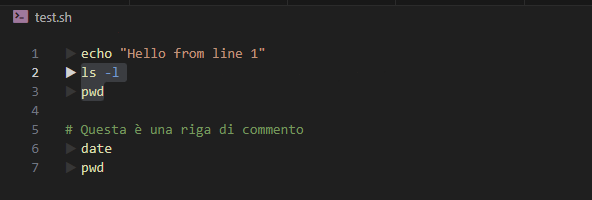

# Shell Line Runner

**Shell Line Runner** is a Visual Studio Code extension that adds a play button (`▶`) to each executable line in a shell script, allowing you to run individual commands or selected blocks directly in the integrated terminal.

## Features

- Adds `▶` play icons next to each executable line in `.sh` files
- Click the icon to run the specific line or selected block in the terminal
- Highlights the active line for better visibility
- Automatically filters out empty lines and comments from selected blocks
- Runs one line at a time for better debugging and readability

## How to Use

1. Open a `.sh` or shell script file.
2. Hover over a line — a faded play icon appears.
3. Select multiple lines if you want to run a block.
4. Click the `▶` on the active line to run the whole block, or on any line to run it individually.

## Requirements

- No dependencies required.
- Works with any standard VS Code installation.

## Known Limitations

- Hover behavior is simulated via selection and not true mouse hover.
- The play icon appears only for shell scripts (`shellscript` language).

## Extension Settings

None (yet).

## Release Notes

### 0.0.1

- Initial release of Shell Line Runner
